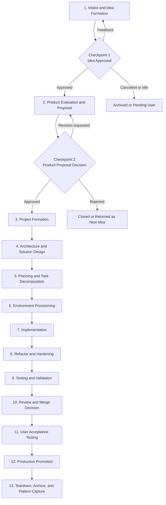

# Agentic SDLC

This doc set modularizes the agentic software delivery lifecycle described in the workbook at [`archive/Agentic Coding/agent_lifecycle_diagram_workbook.md`](../../archive/Agentic%20Coding/agent_lifecycle_diagram_workbook.md).

The workbook is the authoritative source. This documentation reorganizes that source into lifecycle stages, roles, tasks, workflows, tools, artifacts, and agent-facing context packs without changing the system design intent.

## Architecture Layers

- Governance
- Teams
- Roles
- Workflows
- Tasks
- Recipes
- Tools
- Services
- Project context
- Stage context
- Working memory

See [system-architecture.md](system-architecture.md) and [context-model.md](context-model.md) for the layer model.

## Documentation Areas

- [Lifecycle](lifecycle/README.md)
- [Roles](roles/README.md)
- [Teams](teams/README.md)
- [Tasks](tasks/README.md)
- [Workflows](workflows/README.md)
- [Recipes](recipes/README.md)
- [Tools](tools/README.md)
- [Services](services/README.md)
- [Artifacts](artifacts/README.md)
- [Contexts](contexts/README.md)
- [Decision Log](decision-log.md)

## Lifecycle Overview

Stages 1 and 2 are fully specified from the workbook. Stages 3 through 13 are present as minimal placeholders because the workbook names them but does not yet define them in detail.
