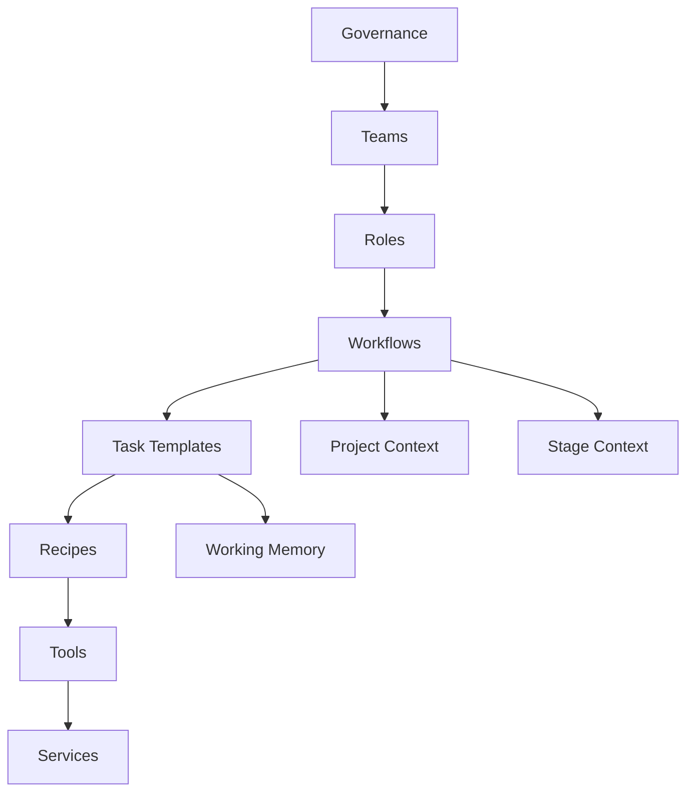

# System Architecture

The workbook defines an agentic SDLC as a layered execution system rather than a single monolithic prompt. Governance constrains teams, teams own roles, roles execute workflows through task templates, and tasks may invoke recipes, tools, and supporting services while project artifacts and runtime state preserve continuity.

## Layer Relationships

## Layer Boundaries

### Governance

Defines global rules, architectural constraints, security policies, and approval gates that apply across the system.

### Teams

Represent organizational ownership and policy boundaries. The workbook names the CLI Team, Platform Team, and AI Systems Team as examples.

### Roles

Represent persistent responsibilities inside the lifecycle. Agents execute the recipes and tasks associated with these roles.

### Workflows

Coordinate stage-level orchestration across tasks, roles, approvals, and loops.

### Tasks

Represent atomic, repeatable work units with defined inputs, outputs, artifacts, and tool use.

### Recipes

Represent reusable multi-step playbooks. The current workbook explicitly names the `conceptual-mock` designer recipe.

### Tools

Represent reusable capabilities such as audio briefing, visual mock generation, and diagram creation.

### Services

Represent the underlying runtime or infrastructure that tools or routing depend on. The current workbook only implies these boundaries and does not define them in detail.

### Project Context

Contains project artifacts such as idea documents, proposals, and specs.

### Stage Context

Indicates the project's current lifecycle stage so agents execute against the correct checkpoint and exit paths.

### Working Memory

Captures temporary execution state in runtime artifacts such as `project-state.json`, `agent-state.json`, `task-state.json`, and `execution-log.md`.
