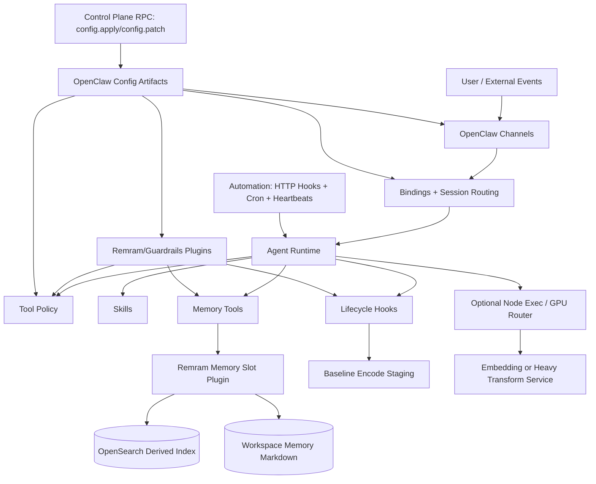
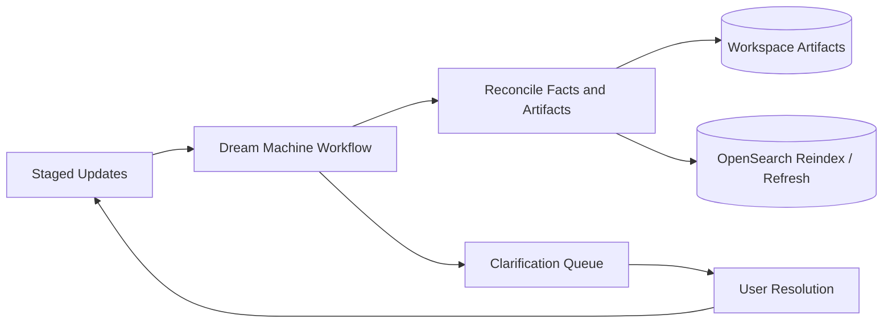

# Remram Architecture Overview

## 1. What Remram Is

Remram is a local-first memory substrate for AI systems.

It provides:

- Persistent, organized long-term memory across users and domains
- Deterministic retrieval (RAM)
- Controlled consolidation and mutation (REM)

Remram is not a chatbot and not a model.
It is the system layer that makes memory real.

---

## 2. Core Thesis

Foundation models are stateless.
Context windows are temporary.

"Infinite memory" is not solved by bigger models.

Memory is an orchestration problem.

Remram solves it by enforcing:

- Structured storage
- Policy gating
- Deliberate retrieval
- Controlled consolidation

---

## 3. Architecture View A: System Interaction Diagram

### 3.1 Runtime System Diagram (Online + Control Plane)

### 3.2 Consolidation Diagram (Offline)

### 3.3 Major Components and Interactions

1. OpenClaw Gateway orchestrates routing, sessions, tools, and policy.
2. Remram memory plugin provides RAM read-path tools (`memory_search`, `memory_get`).
3. Lifecycle hooks execute post-request encode logic for REM staging.
4. Cron/automation execute Dream Machine consolidation and maintenance jobs.
5. OpenSearch stores derived retrieval indexes; workspace markdown/artifacts remain canonical.
6. Guardrails plugin enforces tool-call and persistence safety controls.
7. Optional node-host execution offloads heavy embedding/transformation jobs.

---

## 4. Architecture View B: Implementation by OpenClaw Interface Type

This section organizes implementation by OpenClaw interface/component type rather than by hypothetical standalone services.

The goal is an explicit inventory: every agent id, binding route, plugin/service, hook, cron job, and skill that must exist for the architecture to be executable.

### 4.1 Configuration Composition (`openclaw.json` + `$include`)

Remram use:

- Define modular config tree for agents, bindings, tools, channels, plugins, hooks, and cron
- Keep environment substitution and secrets references centralized
- Use schema validation and restart boundaries as deployment gates

Primary artifacts:

- `config/openclaw.json5` (root)
- `config/agents/*.json5`
- `config/tools/*.json5`
- `config/plugins/*.json5`
- `config/automation/*.json5`

Components to produce (inventory):

- `config/openclaw.json5`: root include graph and global defaults
- `config/agents/defaults.json5`: `agents.defaults.*` (workspaces, model, pruning, sandbox defaults)
- `config/agents/agents.json5`: `agents.list[]` ids and per-agent overrides
- `config/agents/bindings.json5`: `bindings[]` deterministic routing rules
- `config/tools/policy.json5`: tool profiles, allow/deny, provider restrictions
- `config/channels/*.json5`: per-provider channel policy and allowlists
- `config/plugins/plugins.json5`: plugin allow/deny, load paths, slot selection, per-plugin config
- `config/automation/hooks-http.json5`: authenticated `/hooks/*` ingress and mappings
- `config/automation/cron.json5`: scheduled jobs and retention/concurrency controls

### 4.2 Agent and Routing Interfaces (`agents.*`, `bindings[]`)

Remram use:

- Define per-user/per-role agents with isolated workspaces
- Route DMs, groups, and ingestion sessions deterministically
- Enforce sender isolation for family multi-user scenarios

Primary runtime interaction:

- inbound message -> binding match -> selected agent -> policy + tools

Agents to define (inventory):

- `orchestrator`: default chat agent for normal user interactions; calls memory tools; escalates to other agents when needed
- `family_<member>`: one agent per household member (same role as `orchestrator`, but separate workspace + scoped memory)
- `family_group`: group-chat oriented agent (optional if you want different tool/policy profile than DMs)
- `ingestion`: receives external ingestion events and file-drop triggers; produces normalized ingestion artifacts
- `memory_ops`: operator-facing agent for reindex/health checks and incident workflows (runbooks)
- `safety_ops`: operator-facing agent for guardrails review, policy changes, and audit/triage
- `dream_machine`: scheduled consolidation executor (Dream Routine) with restricted tools; writes proposed patches and clarification prompts
- `recall_probe`: diagnostic agent for RAM quality regressions and retrieval trace runs (optional but recommended)

Agent id conventions (inventory):

- `family_<member>` should be a stable slug (e.g., `family_jason`, `family_alex`), not a provider id
- Operator agents should be reachable only from operator-only channels/allowlists
- Scheduled/automation agents should be reachable only from cron/hooks session key prefixes

Bindings to define (inventory patterns):

- `dm -> orchestrator`: route direct messages from allowlisted accounts to `orchestrator` with per-sender scoping
- `dm/<member> -> family_<member>`: route each household member's DMs to their own agent + workspace
- `family_group -> orchestrator`: route household group chat to `orchestrator` with group-scoped memory rules
- `family_group -> family_group`: route household group chat to `family_group` if using a dedicated group agent
- `hooks/ingest -> ingestion`: route HTTP hook `ingest` events to `ingestion` using a dedicated session key prefix (e.g., `hook:ingest:*`)
- `hooks/encode -> dream_machine`: route HTTP hook `encode` events (if enabled) to `dream_machine` or `memory_ops`
- `cron/dream -> dream_machine`: route Dream Machine cron runs to `dream_machine` with `cron:*` session key prefix
- `ops/memory -> memory_ops`: route operator-only channels/peers to `memory_ops`
- `ops/safety -> safety_ops`: route operator-only channels/peers to `safety_ops`

Notes:

- Bindings must be ordered most-specific to least-specific (e.g., member-specific DM routes before the generic `dm -> orchestrator`).

### 4.3 Channel Policy Interfaces (`channels.*`)

Remram use:

- Control who can reach which agents and under what mention/allowlist policy
- Keep channel-specific access boundaries consistent with memory scope boundaries

Primary runtime interaction:

- provider payload -> channel gate -> binding/router

Channel config components (inventory):

- DM policy: allowlist/pairing rules to prevent unknown senders
- Group policy: explicit allowlists for household groups; deny-by-default for other groups
- Mention policy: `requireMention` (or provider equivalent) for public/large groups
- Model overrides: `channels.modelByChannel` (if needed) for ops vs family use

### 4.4 Tool Governance Interfaces (`tools.profile`, allow/deny, byProvider)

Remram use:

- Expose memory tools broadly where safe
- Restrict side-effecting tools to specific agents and contexts
- Keep least-privilege defaults for household-facing agents

Primary runtime interaction:

- agent-selected tool -> policy evaluation -> allowed/blocked execution

Tool policy components (inventory):

- Memory tools: allow `memory_search`, `memory_get` for `orchestrator`, `dream_machine`, `recall_probe`, `memory_ops`
- Ingestion tools: allow ingestion/indexing tools only for `ingestion`, `dream_machine`, `memory_ops`
- Exec tools: allow node execution only for `ingestion`/`dream_machine`/`memory_ops` (never for household default agent)
- File/write tools: restrict filesystem writes to ops + dream machine contexts (or require explicit elevation enforced by guardrails)

### 4.5 Plugin Interfaces (TypeScript Extensions)

#### Memory Slot Plugin (`kind: memory`, `plugins.slots.memory`)

Remram use:

- Implement RAM retrieval API via `memory_search` and `memory_get`
- Index workspace memory/artifacts into OpenSearch as derived data
- Return scored context bundles with provenance metadata

Plugin package(s) to build (inventory):

- `memory-opensearch` (slot `memory`):
  - Tools: `memory_search`, `memory_get`
  - Optional tools: `remram_reindex`, `remram_ingest`, `remram_memory_status`
  - Background service: workspace watcher + batch indexer
  - Storage: OpenSearch index templates + per-tenant index strategy
  - Provenance: stable ids pointing back to workspace files/artifacts

#### Guardrails Plugin

Remram use:

- Centralize tool-call validation and argument normalization
- Redact sensitive outputs before persistence/indexing
- Enforce trust boundaries for plugin HTTP/RPC surfaces

Plugin package(s) to build (inventory):

- `guardrails`:
  - Hooks: `before_tool_call`, `after_tool_call`, `tool_result_persist`
  - Policy: per-agent tool gating and redaction rules
  - Optional: allow an explicit "elevated mode" token/flag to unlock side effects in controlled sessions

#### Ingestion/Indexer Services

Remram use:

- Run background workers for batch indexing, refresh, and repair jobs

Plugin service components (inventory):

- `indexer_service`: batches workspace file changes into OpenSearch updates
- `embedding_service_client`: optional client to node-hosted embedding generation
- `repair_service`: detects and fixes index drift (missing chunks, stale templates)

### 4.6 Lifecycle Hook Interfaces

Remram use:

- `before_prompt_build`: inject top-k relevant memory
- `before_tool_call` / `after_tool_call`: enforce policy and sanitize output
- `tool_result_persist`: sanitize transcript persistence inputs
- `session_end`: produce compact encode candidates for staging

Primary runtime interaction:

- agent lifecycle event -> hook chain -> transformed prompt/tool result/persisted state

Hooks to implement (inventory):

- `before_prompt_build`: recall injection (RAM) and context budgeting
- `before_tool_call`: tool gating (guardrails), argument normalization, deny-by-default enforcement
- `after_tool_call`: output sanitization and memory capture candidates
- `tool_result_persist`: redaction before transcript persistence and indexing
- `session_end`: stage encode candidates for REM

### 4.7 Automation Interfaces (`hooks.*`, `cron.*`, heartbeats)

Remram use:

- HTTP hooks for external ingestion triggers
- Cron for Dream Machine, reindexing, and cleanup windows
- Heartbeats for lightweight ongoing maintenance tasks

Primary runtime interaction:

- webhook/cron tick -> mapped agent/session -> memory updates and workflows

Automation components (inventory):

- HTTP hook endpoints (under `/hooks/*`):
  - `/hooks/ingest`: ingestion events (email/webhook/file-drop) -> `ingestion` agent
  - `/hooks/encode`: optional explicit encode trigger -> `dream_machine` or `memory_ops`

- Cron jobs:
  - `dream_machine_nightly`: nightly consolidation run
  - `reindex_weekly`: weekly full reindex (optional, depends on drift rate)
  - `snapshot_daily`: daily OpenSearch snapshot trigger (ops-controlled)

- Heartbeats:
  - `health_check`: lightweight OpenSearch + memory tool smoke checks
### 4.8 Skills Interfaces (`SKILL.md`)

Remram use:

- Codify runbooks for memory operations, incident response, and safety procedures
- Keep operational behavior auditable and human-editable
- Pair skills with plugin/tool enforcement rather than using skills as enforcement alone

Skills to write (inventory):

- `memory-ops/SKILL.md`: health checks, reindex, snapshot/restore verification
- `ingestion-runbook/SKILL.md`: accepted payload formats, retry policy, dedupe behavior
- `safety-runbook/SKILL.md`: tool escalation policy, redaction rules, incident response steps
- `dream-machine-runbook/SKILL.md`: consolidation workflow, clarification prompt format, failure recovery

### 4.9 Control Plane RPC Interfaces (`config.apply`, `config.patch`)

Remram use:

- Drive CI/CD rollouts for config changes
- Separate hot-apply policy/routing changes from restart-required plugin changes
- Use patch/apply flow for canary and rollback operations

Deployment components (inventory):

- Config validation in CI (schema + include graph)
- Rollout scripts that use `config.patch` for hot changes and `config.apply` for restart-required changes
- Canary/rollback procedure (documented as a skill/runbook)

### 4.10 Node Execution Interfaces (Optional)

Remram use:

- Route heavy embedding or transform jobs to a node-hosted execution environment
- Keep gateway host responsive and OpenSearch stable under load

Node execution components (inventory):

- Node host target for embeddings/transforms (GPU router box)
- Allowlisted exec commands and approvals on the execution host
- Tool policy that prevents household agents from invoking node exec

---

## 5. RAM and REM Responsibilities Mapped to Interfaces

### 5.1 RAM (Read Path)

- Implemented through memory slot plugin + memory tools
- Governed by tool policy and scope filters
- Injected into prompts via lifecycle hooks
- Backed by OpenSearch derived retrieval index

### 5.2 REM (Write/Consolidation Path)

- Baseline Encode runs in lifecycle hooks after requests/tool chains
- Dream Machine runs through cron/automation workflows
- Consolidation updates artifacts/facts and refreshes indexes
- Low-confidence mutations feed clarification queues

---

## 6. System Invariants

- RAM never mutates memory
- REM never serves live queries
- Policy gating precedes ranking
- Vectors are ranking signals, not truth
- Workspace artifacts remain canonical; indexes are derived
- Cloud cognition is stateless and replaceable

---

## 7. Implementation Sequence (OpenClaw-Native)

1. Build config composition skeleton (`agents`, `bindings`, `tools`, `plugins`, `hooks`, `cron`).
2. Implement and slot the Remram memory plugin (`memory_search`, `memory_get`).
3. Add lifecycle hooks for baseline encode, guardrails, and persistence sanitization.
4. Add HTTP hooks and cron workflows for ingestion and Dream Machine consolidation.
5. Add skills for runbooks and operations.
6. Operationalize rollout via `config.patch`/`config.apply` and canary procedures.

Architecture is executable when each capability is anchored to an OpenClaw interface type.
