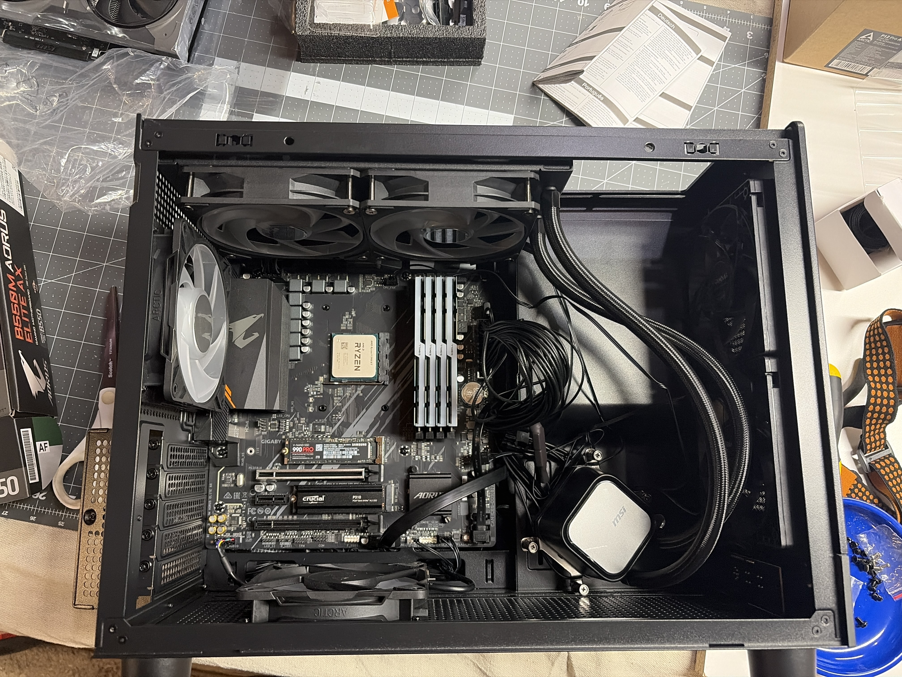
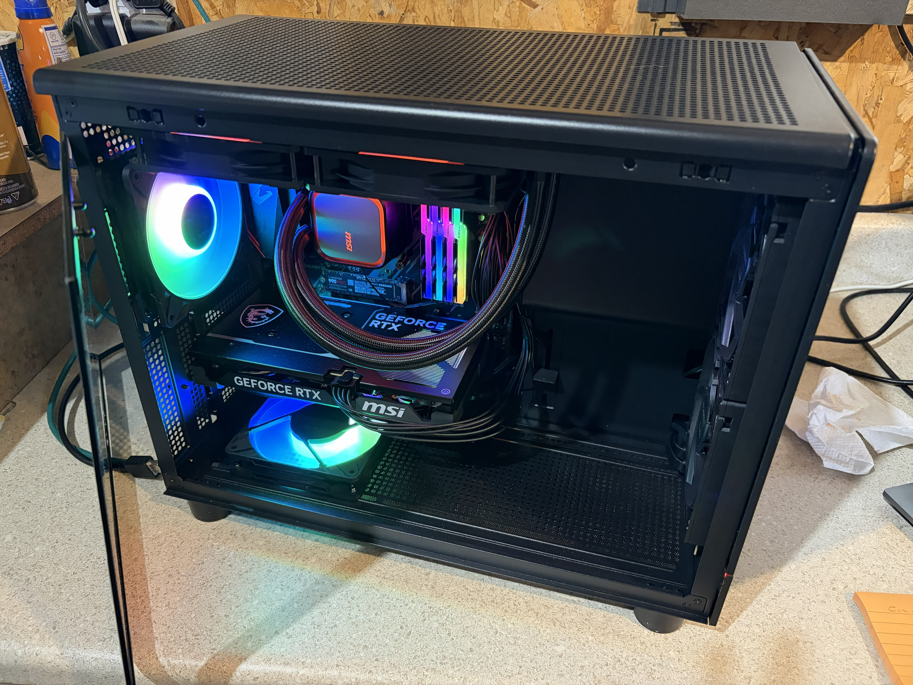

# Moltbox Prime

Moltbox Prime is the creator reference build.

It captures the build posture behind the first serious "this should live on the desk and run all the time" Moltbox, rather than a purely theoretical hardware tier.

## Snapshot

- Builder: Jason
- Build family: Family
- Order date: February 25, 2026
- Build window: late February to early March 2026
- Design goal: a practical always-on Moltbox with real local capability, without jumping all the way to an oversized multi-GPU system

## Photo

## What Prime Was Optimizing For

Moltbox Prime was not meant to be the biggest box possible.

It was meant to be the first convincing "real" Moltbox:

- strong enough to run local routing and support long-term system growth
- modest enough to stay grounded in real-world builder economics
- capable of sitting on a desk and being treated like an appliance, not a rack project

At the time, RAM pricing was unusually high because of broader AI demand. That made disciplined sizing part of the design instead of an afterthought, and it is part of why this build landed on a very intentional cost-performance middle tier.

## Actual Build Parts

This is the ordered hardware set for Moltbox Prime:

- CPU: AMD Ryzen 9 5900XT, 16-core, Zen 3, AM4
- Motherboard: GIGABYTE B550M AORUS ELITE AX (rev 1.3), Micro-ATX
- Cooler: MSI MAG Coreliquid A13 240 Black, 240mm AIO
- RAM: G.Skill Trident Z Neo 128GB (4x32GB) DDR4-3200, kit `F4-3200C16Q2-256GTZN`
- GPU: MSI Ventus GeForce RTX 5060 Ti 16GB GDDR7
- Power supply: MSI MAG A650GLS PCIE5, 650W, 80+ Gold, fully modular
- Case: Gamdias ATHENA M4M micro-ATX small form factor case
- Storage:
  - Crucial P310 2TB NVMe
  - Samsung 990 PRO 2TB NVMe
  - Reused 14TB enterprise HDD for backup storage, likely a Seagate Exos model

## Price Snapshot

These prices matter because Moltbox Prime was explicitly a real-world builder decision, not a hypothetical unlimited-budget reference.

- Main Newegg shipment subtotal after discounts: $1,262.97
- Secondary SSD order: $398.95
- Case order: $92.68
- RAM order: $544.92
- Grand total: $2,305.34

Notable order pricing from February 25, 2026:

- Ryzen 9 5900XT: $311.00
- RTX 5060 Ti 16GB: $599.99
- B550M motherboard: $119.99
- MSI 240mm AIO: $84.99, fully offset by discount
- MSI 650W PSU: $104.99, fully offset by discount
- Crucial P310 2TB: $264.99
- Samsung 990 PRO 2TB: $398.95
- Gamdias ATHENA M4M case: $79.99
- G.Skill Trident Z Neo 128GB DDR4 kit: $544.92 on eBay, ordered February 24, 2026 and delivered March 5, 2026

The RAM sourcing tells its own story. Memory pricing was volatile enough that part of the build had to come from eBay instead of the main retail order flow, which is exactly the kind of real-world constraint this page is meant to preserve.

## Build Profile

Moltbox Prime fits the recovered design notes closely:

- 16-core CPU
- 128GB RAM
- 16GB Blackwell-class GPU
- two 2TB NVMe drives plus a separate backup HDD

The build now matches the original Family-tier posture directly: 16 cores, 128GB RAM, a 16GB GPU, and dual NVMe storage.

Suggested split from the original notes:

- Drive 1: Crucial P310 2TB for operating system, OpenClaw runtime, and local Git
- Drive 2: Samsung 990 PRO 2TB in the fast CPU-attached NVMe slot for OpenSearch and persistent database storage
- Drive 3: reused 14TB enterprise HDD for backup and bulk recovery storage

The GPU was intentionally kept at the practical 16GB baseline to control cost while preserving routing stability.

## Why These Parts Made Sense

- The `5900XT` kept the build on a cost-effective AM4 platform while still delivering the 16 cores the original Family-tier posture called for.
- The `128GB` DDR4 kit preserved the original design target even in a distorted memory market.
- The `RTX 5060 Ti 16GB` matched the earlier design assumption that 16GB VRAM was the practical floor for a serious local routing tier.
- The dual-SSD layout reinforced the conceptual split between system/runtime concerns and durable knowledge storage, with the faster CPU-attached `990 PRO` reserved for OpenSearch.
- The reused `14TB` enterprise drive added cheap backup capacity without distorting the core build budget.
- The small-form-factor `ATHENA M4M` case kept the build tangible and desk-friendly instead of drifting into workstation excess.

## Tradeoffs Captured By This Build

- It was intentionally not a maximal local reasoning box.
- It favored a strong local orchestration tier and governed appliance management over prestige hardware.
- It accepted moderate cloud escalation instead of trying to eliminate it with extreme GPU spend.
- It treated appliance realism, noise, space, and cost as part of the architecture.

## Why This Tier Mattered

Prime sat in the middle on purpose.

It was stronger than a light edge appliance, but it stopped short of the "buy a monster workstation and solve everything with hardware" instinct. The goal was to prove that a Moltbox could be local, tangible, and useful without becoming absurd.

## What Should Survive From This Build

- the idea of a Family-tier Moltbox as the default serious reference build
- local-first authority with moderate cloud escalation
- a split-storage posture that treats system/runtime and durable knowledge differently
- cost-aware hardware choices instead of prestige hardware choices

## What Is Still Missing

This page now preserves both the historical build intent and the exact February 25, 2026 order record, but it is still missing a few final assembly details.

If the remaining details are recovered later, they should be added here as:

- exact backup drive model
- case, PSU, and cooling notes
- storage role confirmation after final install
- what was chosen, what was skipped, and why
