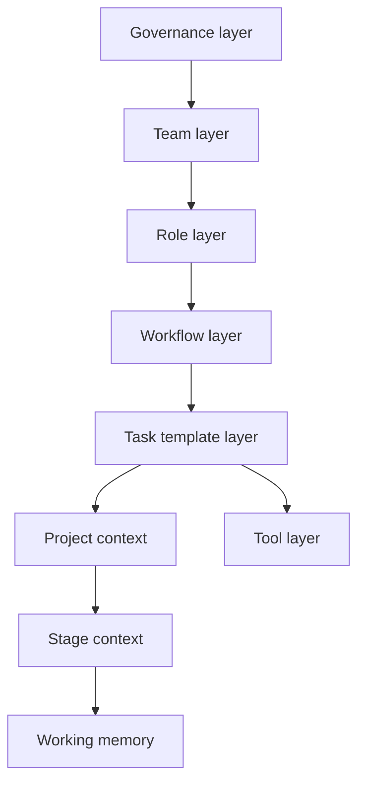

# Context Model

The workbook describes agent execution context as a layered "brain" assembled from multiple sources. Each layer serves a different purpose and should remain distinct.

## Layer Stack

## Governance Layer

Global rules and architectural guidance that apply to all teams and roles.

Examples from the workbook:

- architecture constraints
- security policies
- approval gates
- rule example: all new CLI configuration surfaces require approval from Jason

## Team Layer

Organizational ownership and mission boundaries.

Named examples from the workbook:

- CLI Team
- Platform Team
- AI Systems Team

Team documents are expected to carry mission, owned systems, rules, and approval requirements.

## Role Layer

Persistent responsibilities inside the SDLC.

Named examples from the workbook:

- Customer Success Manager
- Product Manager
- Designer
- Architect
- OpenClaw SME

Agents execute the recipes associated with these roles.

## Workflow Layer

Stage-level orchestration that sequences task templates to complete lifecycle work.

Named examples from the workbook:

- Idea Intake Workflow
- Product Proposal Workflow
- Feature Definition Workflow

## Task Template Layer

Atomic units of repeatable work.

Named examples from the workbook:

- discovery interview
- idea triage
- capability decomposition
- proposal generation

Each task template defines:

- inputs
- outputs
- artifacts produced
- tools used

## Project Context

The project-specific artifact set used during delivery.

Example locations from the workbook:

- `/roadmap/proposals/<proposal>.md`
- `/features/<feature-name>/feature-spec.md`

## Stage Context

The active lifecycle stage for the project.

Example from the workbook:

- `Stage 2 - Product Evaluation`

## Working Memory

Temporary reasoning state stored in runtime artifacts.

Examples from the workbook:

- intermediate notes
- execution progress
- reasoning checkpoints

## Tool Layer

Reusable capabilities used while tasks execute.

Examples from the workbook:

- audio brief generator
- visual mock generator
- diagram generator
